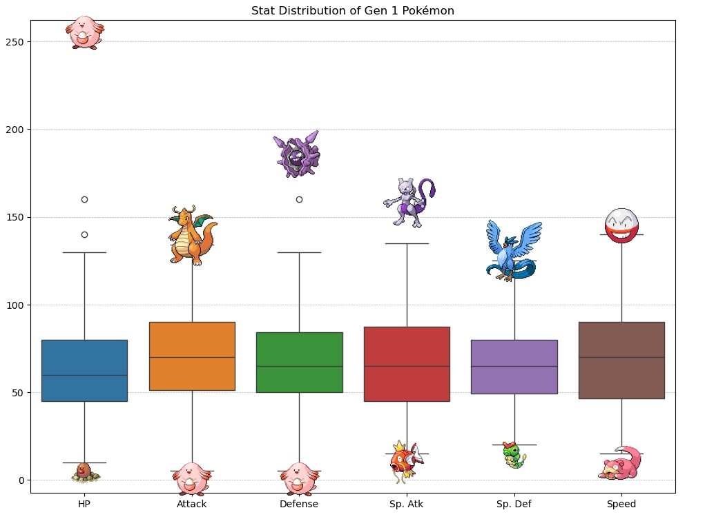
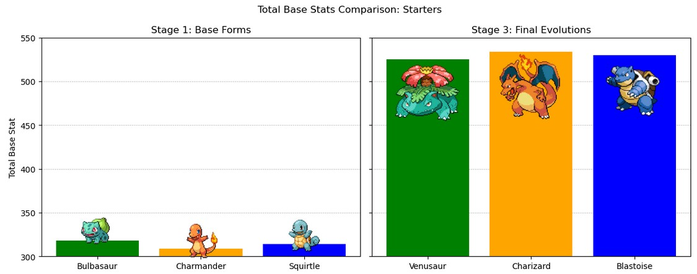
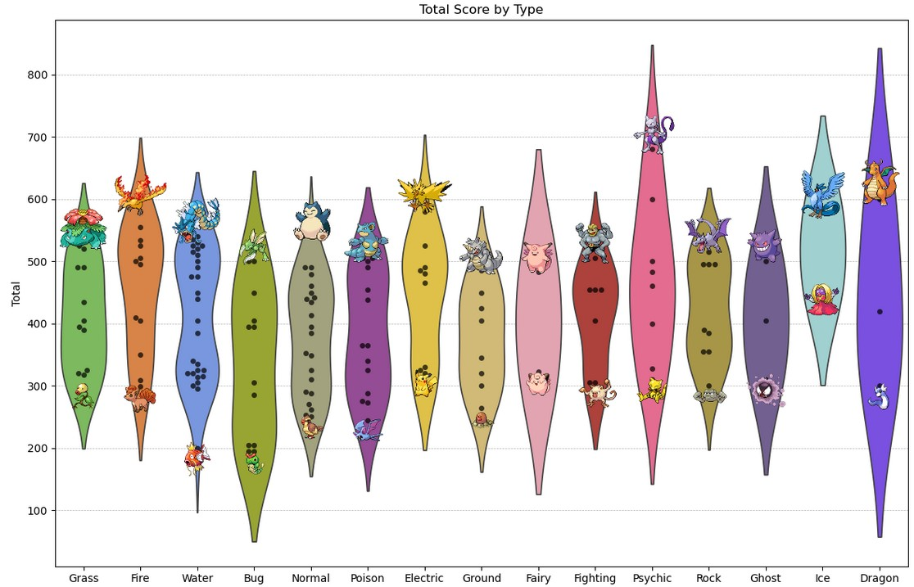
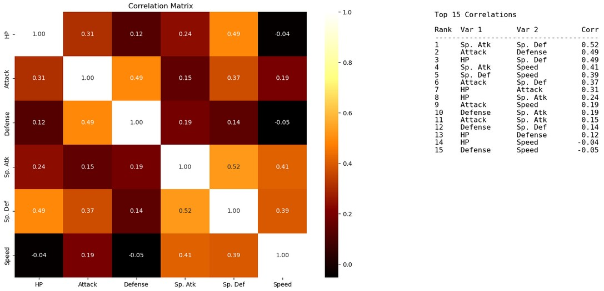

# 🧬 Pokémon Base Stats EDA (Gen 1 – Kanto)

This project explores the original 151 Pokémon from Generation I using Python-based data analysis and visualization. It combines classic base stats with **type advantage logic** to engineer new insights, and visualizes them through rich, interpretable graphics.





---

## 📄 License

This project is licensed under the [Creative Commons Attribution-NonCommercial 4.0 International License](https://creativecommons.org/licenses/by-nc/4.0/).  
You are free to use, adapt, and share the materials for **non-commercial purposes**, with proper attribution.

---

## 🧾 Project Overview

- 📋 151 Pokémon from the Kanto region (Gen 1)
- 📊 Base stats: HP, Attack, Defense, Sp. Atk, Sp. Def, Speed
- 🧠 Derived stats: Total base stat, Type Score (based on weaknesses & strengths)
- 📈 Visualizations to uncover relationships and design patterns

> 🧠 This project combines numeric stats with **game mechanics logic** to create a new feature: a "type score" that can be added to a Pokémon’s base stat total.

---

## 🧪 Goals

- Understand base stat distributions in Gen 1
- Compare Pokémon by both stat and **type effectiveness**
- Engineer a new score using **type chart math**
- Explore stat relationships via **correlation analysis**

---

## 🛠️ Techniques Used

- `pandas` for data wrangling
- `matplotlib` and `seaborn` for plotting
- Custom logic to:
  - Score Pokémon types based on offensive and defensive advantage
  - Handle dual types and compute blended type scores
- Correlation matrix to analyze how stats interact

---



---

## 🎯 Project Highlights

- 📌 Combines gameplay mechanics with raw stats
- ⚖️ Introduces a "Type Score" feature that quantifies elemental advantage
- 📊 Offers clean visuals and stat correlation insights
- 👥 Useful for game balance discussions or competitive retro analysis

---

## 📂 Repository Structure

```plaintext
.
├── data/               # Pokémon base stats CSV
├── assets/             # Visualizations, plots
├── notebooks/          # Main Jupyter notebook
└── README.md           # This file
